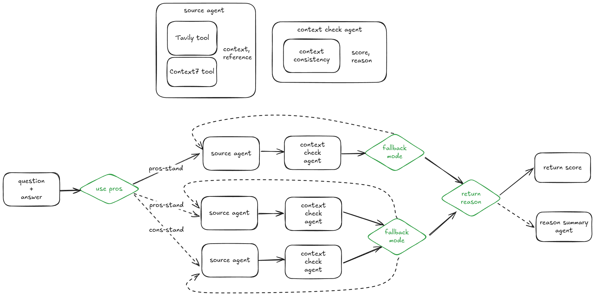

# Halucination Check Agent



- LLM 응답 내 할루시네이션(사실과 다른 정보)과 자기모순 여부를 검출하는 평가 에이전트입니다.
- **Context7** 툴은 구현되지 않았습니다.

## 📚 Reference

* [SelfCheckAgent(25.02)](https://arxiv.org/html/2502.01812v1)
* [SelfCheckGPT(23.10)](https://github.com/potsawee/selfcheckgpt)
* [NLI 기반 문장 자기모순 및 할루시네이션 평가 방법 요약](assets/what_is_nli.md)

## 고민 및 설계 결정

### 긴 문장도 가능한가?

* 예제는 대부분 짧지만, 대표적인 할루시네이션 벤치마크 데이터셋([wiki\_bio\_gpt3\_hallucination](https://huggingface.co/datasets/potsawee/wiki_bio_gpt3_hallucination))의 Ground Truth는 상당히 긴 문장도 포함.
* 따라서 긴 문장에 대해서도 평가가 가능하다고 생각.

### NLI vs Ngram vs LLM-API

* **LLM-API 기반**은 속도는 느리지만 성능이 가장 우수하고, 왜 그런 평가를 내렸는지에 대한 추가적인 reasoning 정보도 함께 제공 가능.
* 단, LLM 호출 실패(fallback) 가능성은 존재.
* **속도가 중요하거나 도메인 특화** 환경이라면 작은 NLI 모델을 튜닝해서 사용하는 방식도 고려 가능.

---

## 💻 How to Run

### 1. 클론 및 의존성 설치

```bash
git clone https://github.com/middlek/halucination_check_agent.git
cd halucination_check_agent
uv venv
source .venv/bin/activate
uv sync
```

### 2. Langfuse 실행

```bash
cd langfuse
docker compose up -d
```

Langfuse가 `http://localhost:3000`에서 실행됩니다. 로그인 후 프로젝트 생성 및 API 키 발급.

### 3. 환경변수 설정

```bash
# Copy example environment file and configure
cp .env.example .env

# Edit .env file with your API keys:
# - OpenAI API key (required)
# - Tavily API key (required for search mode)  
# - Langfuse keys (required for observability)
```

### 4. 서버 실행

#### A2A 프로토콜 서버:

```bash
uv run src/server/app_a2a.py
```

#### FastA2A 서버 (간단한 버전):

```bash
uv run src/server/app_fasta2a.py
```

서버 실행 후 `http://localhost:8008/docs`에서 API 테스트 가능합니다.

---

## 🔧 Basic Concepts

### NLI 기반 할루시네이션 검출

이 시스템은 **Natural Language Inference(NLI)** 접근법을 사용하여 할루시네이션을 검출합니다:

1. **컨텍스트 수집**: Tavily 검색 또는 사용자 제공 컨텍스트
2. **일관성 평가**: 컨텍스트와 검증할 문장 간의 논리적 관계 분석
3. **점수 산출**: 0.0(일치) ~ 1.0(모순) 사이의 할루시네이션 점수
4. **이유 제공**: 평가 결과에 대한 상세한 설명

### 두 가지 평가 모드

**검색 모드 (Search Mode)**:
- Tavily API를 통해 자동으로 관련 정보 검색
- 찬성(pros)/반대(cons) 관점 지원
- 일반적인 사실 확인에 적합

**컨텍스트 모드 (Context Mode)**:
- 사용자가 직접 참조 컨텍스트 제공
- 도메인별 특화 평가 가능
- 더 빠른 응답 시간

---

## 🤖 Agent Types

### 1. Get Source Agent
- **역할**: Tavily 검색을 통한 컨텍스트 수집 및 요약
- **입력**: 검증할 질의 + 검색 관점(pros/cons)
- **출력**: 요약된 컨텍스트 + 참조 URL 목록

### 2. Context Consistency Agent 
- **역할**: NLI 기반 할루시네이션 평가
- **입력**: 컨텍스트 + 검증할 문장
- **출력**: 할루시네이션 점수(0.0-1.0) + 평가 이유

### 3. Reason Summary Agent
- **역할**: 다중 평가 결과의 한국어 요약
- **입력**: 여러 평가 이유 목록
- **출력**: 통합된 한국어 요약 (300자 이내)

---

## 📡 A2A Client Guide

### client 테스트 실행

프로젝트에 포함된 CLI 클라이언트를 직접 사용:

```bash
# 검색 모드로 실행
uv run src/client/a2a_client.py --agent-type search

# 컨텍스트 모드로 실행  
uv run src/client/a2a_client.py --agent-type context

# 예제 컨텍스트 파일 사용
uv run src/client/a2a_client.py --agent-type context --use-example-context
```

### A2A 클라이언트 작성 (추천)

```python
import asyncio
from uuid import uuid4
import httpx
from a2a.client import A2AClient, A2ACardResolver
from a2a.types import Message, MessageSendParams, SendStreamingMessageRequest

class HallucinationCheckClient:
    def __init__(self, host="localhost", port=8008):
        self.base_url = f"http://{host}:{port}"
        
    async def check_with_search(self, statement):
        """검색 기반 할루시네이션 검사"""
        async with httpx.AsyncClient() as httpx_client:
            # A2A 에이전트 카드 가져오기
            agent_card = await A2ACardResolver(
                httpx_client=httpx_client,
                base_url=self.base_url,
            ).get_agent_card()

            # A2A 클라이언트 생성
            client = A2AClient(
                httpx_client=httpx_client,
                agent_card=agent_card,
            )

            # 메시지 페이로드 구성
            context_id = uuid4().hex
            send_message_payload = {
                "message": Message(
                    message_id=uuid4().hex,
                    context_id=context_id,
                    role="user",
                    parts=[{"type": "text", "text": statement}],
                ),
                "metadata": {
                    "enable_tavily_search_engine/v1": {"enable": True}
                }
            }

            # 스트리밍 메시지 요청
            message_request = SendStreamingMessageRequest(
                id=uuid4().hex, 
                params=MessageSendParams(**send_message_payload)
            )

            # 응답 처리
            async for chunk in client.send_message_streaming(message_request):
                chunk_data = chunk.model_dump(mode='json', exclude_none=True)
                # 진행 상황 출력
                if status := chunk_data.get("result", {}).get("status"):
                    print(f"Status: {status['state']}")
                    
                # 완료된 결과 반환
                if chunk_data.get("result", {}).get("status", {}).get("state") == "completed":
                    return chunk_data["result"]

    async def check_with_context(self, statement, context):
        """컨텍스트 기반 할루시네이션 검사"""
        async with httpx.AsyncClient() as httpx_client:
            agent_card = await A2ACardResolver(
                httpx_client=httpx_client,
                base_url=self.base_url,
            ).get_agent_card()

            client = A2AClient(
                httpx_client=httpx_client,
                agent_card=agent_card,
            )

            context_id = uuid4().hex
            send_message_payload = {
                "message": Message(
                    message_id=uuid4().hex,
                    context_id=context_id,
                    role="user",
                    parts=[{"type": "text", "text": statement}],
                ),
                "metadata": {
                    "set_input_context_explicitly/v1": {"input_context": context}
                }
            }

            message_request = SendStreamingMessageRequest(
                id=uuid4().hex, 
                params=MessageSendParams(**send_message_payload)
            )

            async for chunk in client.send_message_streaming(message_request):
                chunk_data = chunk.model_dump(mode='json', exclude_none=True)
                if chunk_data.get("result", {}).get("status", {}).get("state") == "completed":
                    return chunk_data["result"]

# 사용 예시
async def main():
    client = HallucinationCheckClient()

    # 검색 기반 평가
    print("=== 검색 기반 평가 ===")
    result1 = await client.check_with_search("Tesla invented the light bulb")
    print(f"Result: {result1}")

    # 컨텍스트 기반 평가
    print("\n=== 컨텍스트 기반 평가 ===")
    context = "Tesla was known for AC electrical systems and wireless technology."
    result2 = await client.check_with_context("Tesla invented the light bulb", context)
    print(f"Result: {result2}")

if __name__ == "__main__":
    asyncio.run(main())
```

---
